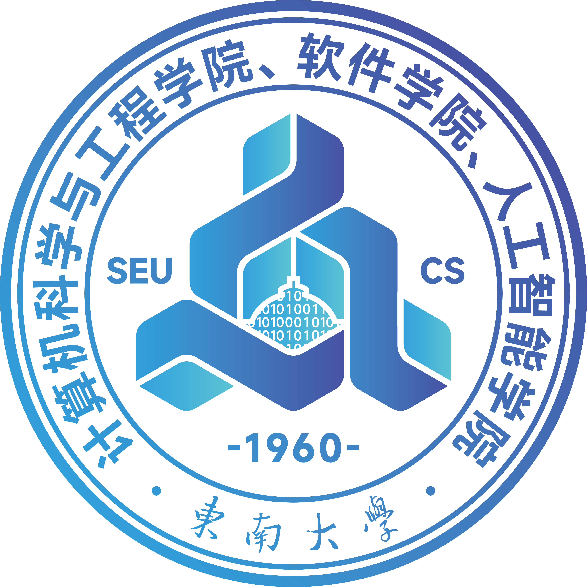
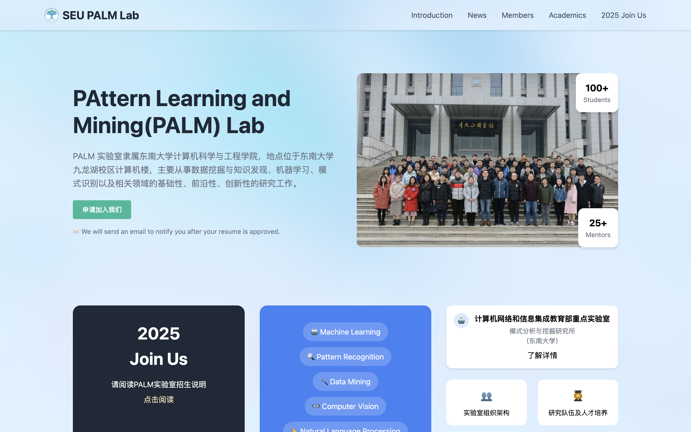
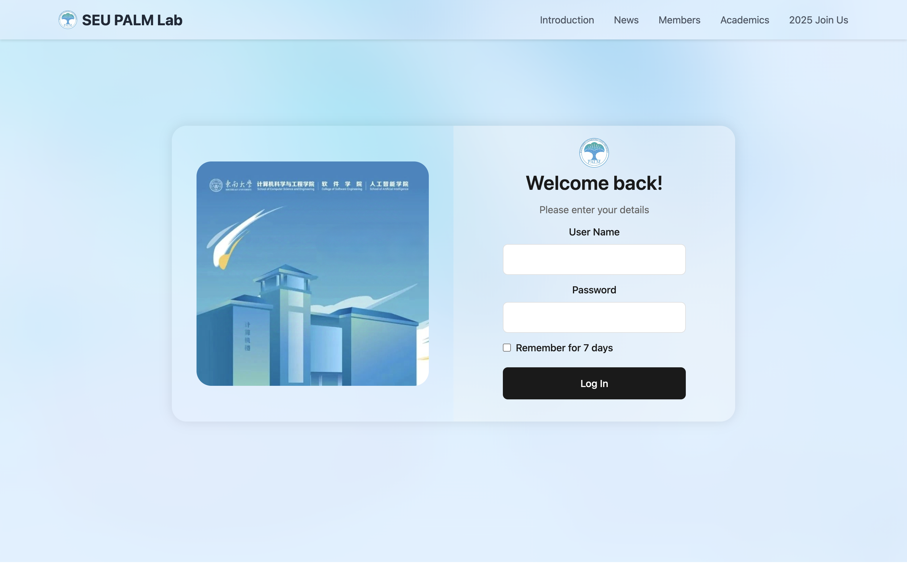
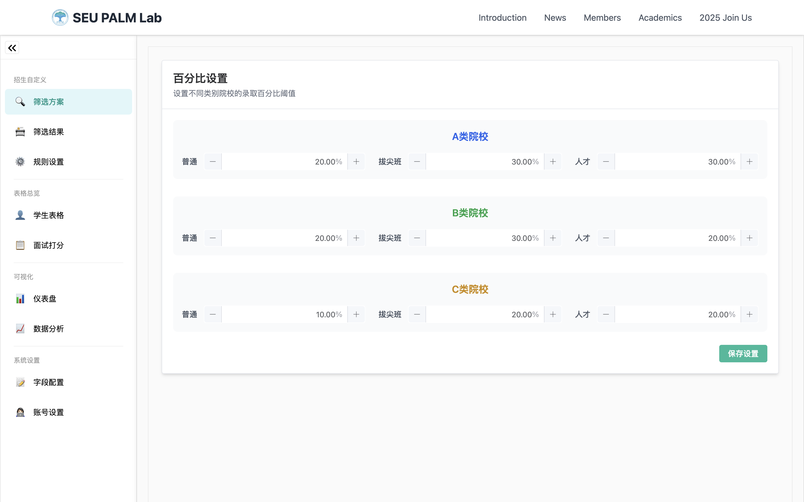
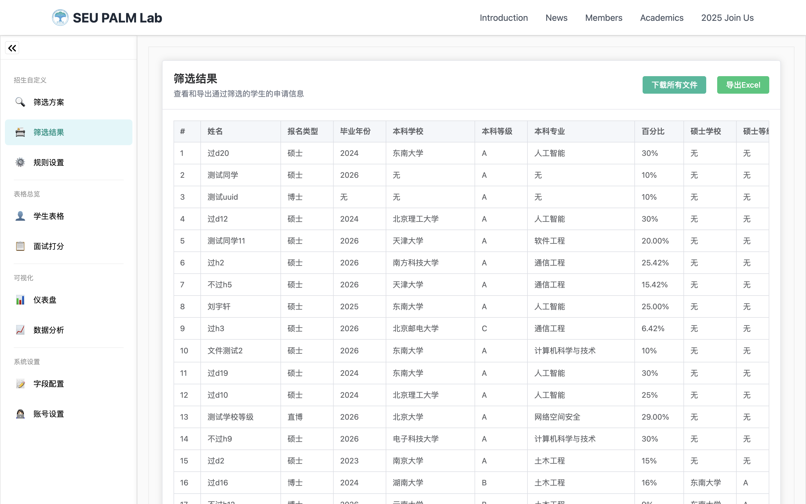
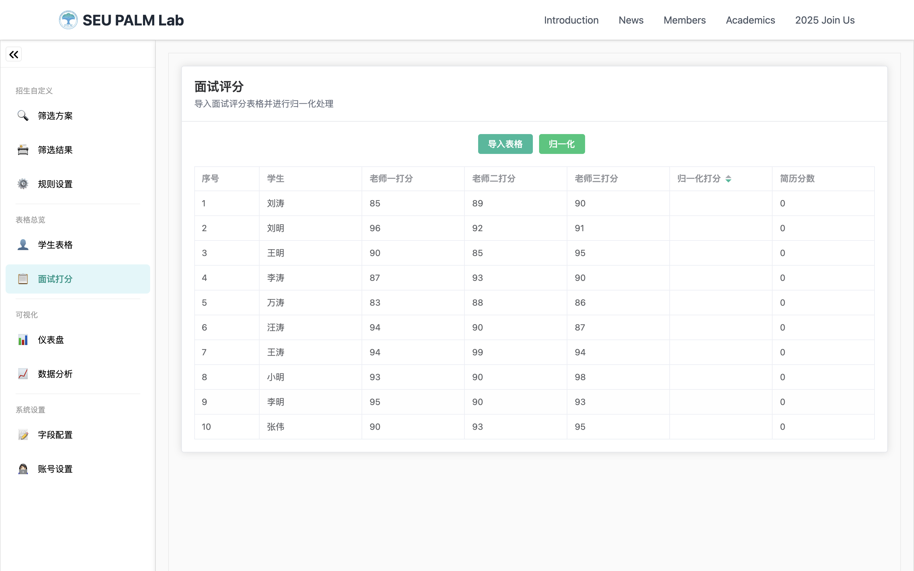
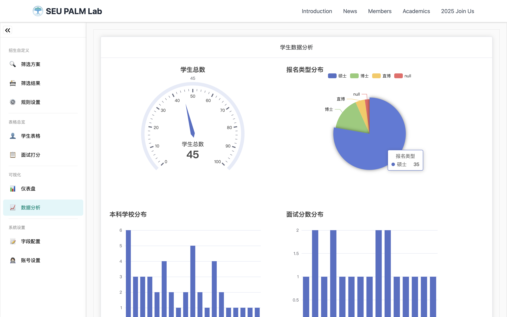
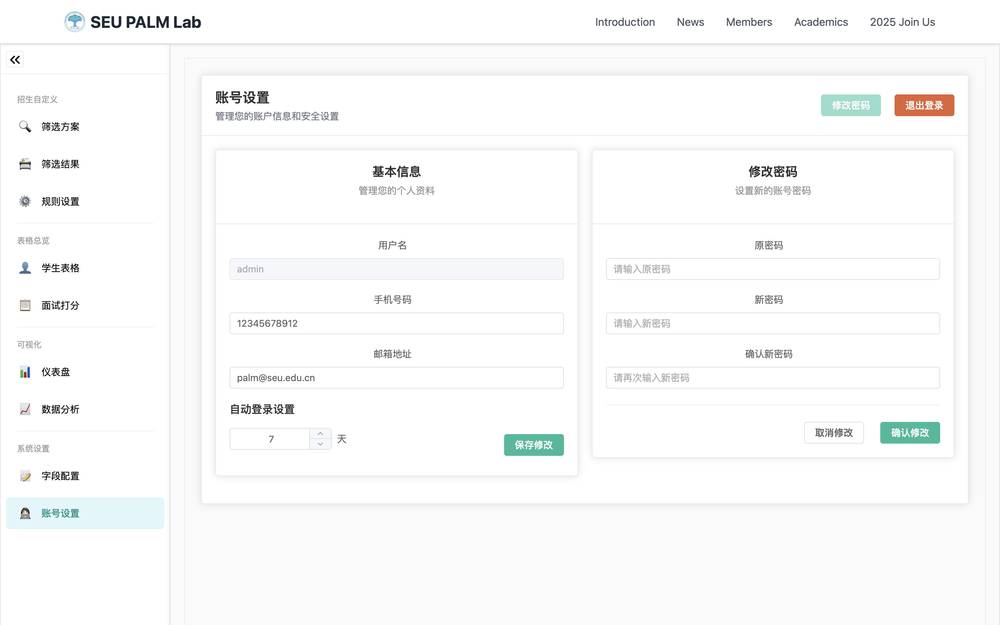
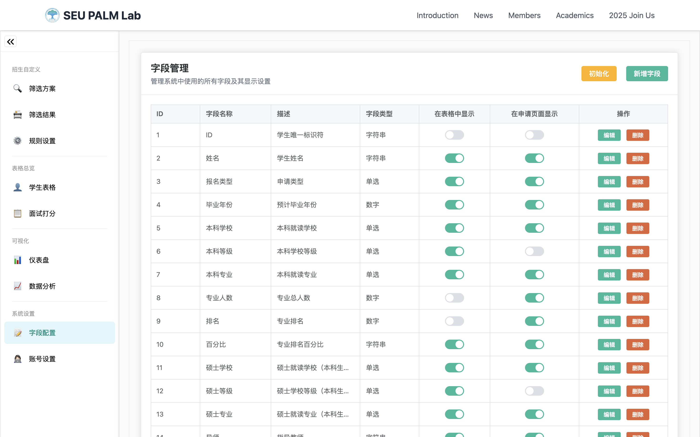
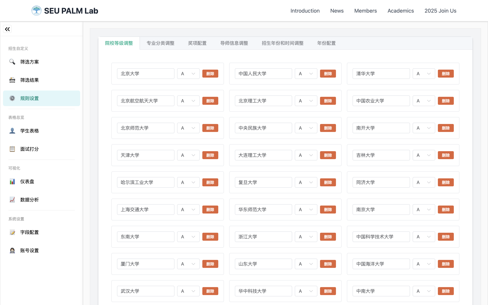

<h1 align="center">东南大学 PALM 实验室研究生招生管理系统</h1>

<p align="center">
  
  
</p>

## 项目简介

东南大学 PALM 实验室研究生招生管理系统 PALM AMS (Pattern Learning and Mining Lab Admissions Management System) 是一个现代化的教育机构招生管理平台，采用前后端分离架构设计，提供完整的招生流程管理、学生信息管理、数据分析等功能。系统致力于提升招生工作效率，优化管理流程，为教育机构提供专业的招生解决方案。

## 地址
- 通用地址：https://palm.inon.space
- 海外地址：https://palm-ams.vercel.app
- IP地址：http://139.155.248.15

## 技术栈

### 前端
- Vue 3 + TypeScript
- Vite
- Tailwind CSS

### 后端
- Django (Python)
- MySQL

## 系统架构

项目采用微服务架构，包含三个主要模块：

- `front-vite/`: 基于Vue 3的前端应用
- `back-django/`: 基于Django的后端服务

## 环境要求

- Node.js >= 16
- Python >= 3.8
- MySQL >= 8.0
- pnpm >= 8.0

## 快速开始

### 前端启动

```bash
# 进入前端目录
cd front-vite

# 安装依赖
pnpm install

# 启动开发服务器
pnpm dev
```

### Django服务启动

```bash
# 进入Django目录
cd back-django

# 创建虚拟环境
python -m venv venv
source venv/bin/activate  # Windows使用: .\venv\Scripts\activate

# 安装依赖
pip install -r requirements.txt

# 数据库迁移
python manage.py migrate

# 启动服务器
python manage.py runserver
```

## 主要功能

- 📝 招生申请管理
- 👥 学生信息管理
- 🔐 用户权限控制
- 📊 数据统计分析
- 📱 响应式界面设计
- 🔍 高级搜索过滤

## 系统截图

### 系统主页
<p align="center">
  
</p>


### 登录界面
<p align="center">
  
</p>

### 筛选功能
<p align="center">
  
  
</p>

### 面试评分
<p align="center">
  
</p>

### 数据统计
<p align="center">
  
</p>

### 系统设置
<p align="center">
  
  
  
</p>

## 项目结构

```
├── front-vite/          # Vue 3前端项目
├── back-django/         # Django后端服务
├── docs/                # 项目文档
└── README.md           # 项目说明
```

## 贡献指南

1. Fork 本仓库
2. 创建新的功能分支 (`git checkout -b feature/AmazingFeature`)
3. 提交更改 (`git commit -m 'Add some AmazingFeature'`)
4. 推送到分支 (`git push origin feature/AmazingFeature`)
5. 提交Pull Request

## 许可证

本项目采用 MIT 许可证 - 查看 [LICENSE](LICENSE) 文件了解详情

## 联系我们

如有任何问题或建议，欢迎提交 Issue 或 Pull Request。
